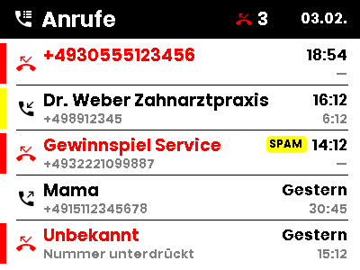
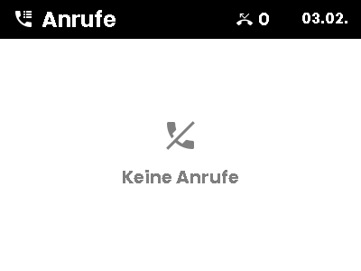

# FRITZ!Box Call Monitor

A Home Assistant custom integration that **replaces** the core
`fritzbox_callmonitor` integration. It keeps everything core does and adds the
two things it does not have:

- **Call history** — the router's own call list as a sensor, shaped so a
  template can loop over it. It survives Home Assistant restarts and includes
  calls that happened while Home Assistant was down, because the list lives on
  the box, not here.
- **Reverse lookup** (optional, off by default) — a name for numbers your
  FRITZ!Box phonebook does not know.

## It overrides the core integration

Installing this shadows `homeassistant/components/fritzbox_callmonitor`
entirely. Home Assistant will log a warning about that; it is expected.

Your existing config entry keeps working — same setup, same credentials, and
the call-state sensor keeps its entity ID and its recorded history. There is
nothing to migrate.

The cost is that core fixes no longer reach you automatically. See `AGENTS.md`
for the baseline this was forked from and `scripts/diff-core` for pulling
changes forward.

## Entities

| Entity | State | Attributes |
|---|---|---|
| `sensor.<box>_call_monitor_<phonebook>` | `idle` / `ringing` / `dialing` / `talking` | the call in progress (unchanged from core) |
| `sensor.<box>_call_history_<phonebook>` | timestamp of the most recent call | `calls`, `total_calls`, `missed_calls` |

The history sensor's state changes exactly once per call, which makes it a
clean automation trigger.

Each entry in `calls` always has every one of these keys, so templates never
need `default()`:

```yaml
id: "17"
type: missed          # incoming | missed | outgoing | rejected
                      # | active_incoming | active_outgoing
number: "+4930111222" # the other party
own_number: "+4989000"
name: Max Mustermann  # or null
name_source: phonebook  # phonebook | fritzbox | dasoertliche | tellows | unknown
vip: false            # from the phonebook contact category
spam_score: null      # tellows 1-9, when enabled
device: Fon 1
timestamp: "2026-02-03T09:00:00+01:00"
duration: 0           # seconds
icon: mdi:phone-missed
```

## Using it on a display

A ready-made blueprint for a **400x300 BWRY** tag ships in
[`blueprints/automation/fritzbox_callmonitor/call_list_400x300.yaml`](blueprints/automation/fritzbox_callmonitor/call_list_400x300.yaml).
Copy it into `config/blueprints/automation/` and create an automation from it —
it asks for the call history sensor, the displays, and optionally a font.

The bundled `ppb.ttf` (Poppins Bold) and `rbm.ttf` (Roboto Medium) always work.
Any other font has to be placed in `/config/www/fonts/`, `/config/media/fonts/`
or `/media/fonts/` on your Home Assistant first — an absolute path works too.
A font that cannot be found falls back to `ppb.ttf` with a warning, so a typo
shows up as "nothing changed" rather than an error.



It uses all four colors the panel has:

- **red** — missed calls: the name, the icon and a marker down the left edge
- **yellow** — a left-edge marker for phonebook VIP contacts (category 1), and a
  `SPAM` badge when tellows scored the caller 6 or higher
- **gray** — the number under the name, and the duration
- a **globe** before the number when the name came from reverse lookup rather
  than from your own phonebook — a directory's guess and your own contact should
  not read as equally trustworthy
- for a missed call, the time it rang where the duration would otherwise be

Names are truncated by pixel width, so a long one can never run into the date
column. With no calls at all it draws an empty state:



`scripts/preview-blueprint.py` renders the blueprint's payload to a PNG without
Home Assistant, which is how the layout above was checked. Use it after editing
the template:

```bash
uv run --with jinja2 --with odl-renderer python scripts/preview-blueprint.py
```

### Writing your own

The payload of `opendisplay.drawcustom` is rendered as a template, so the whole
list can be looped over:

```yaml
alias: Call list on the e-paper display
triggers:
  - trigger: state
    entity_id: sensor.fritz_box_7590_call_history_telefonbuch
actions:
  - action: opendisplay.drawcustom
    target:
      device_id: YOUR_DEVICE_ID
    data:
      background: white
      payload: >
        [
          {"type": "text", "value": "Anrufe", "x": 10, "y": 10, "size": 20}
          
          ,{
            "type": "icon",
            "value": "{{ call.icon }}",
            "x": 10,
            "y": {{ 46 + loop.index0 * 22 }},
            "size": 14,
            "color": "{{ 'red' if call.type == 'missed' else 'black' }}",
            "anchor": "lm"
          }
          ,{
            "type": "text",
            "value": "{{ call.name or call.number }}",
            "x": 32,
            "y": {{ 46 + loop.index0 * 22 }},
            "anchor": "lm"
          }
          
        ]
```

Note the **leading** commas: with conditional elements in the loop, putting the
separator before each element is what keeps the JSON valid no matter which
branches fire.

Nothing about the data is OpenDisplay-specific — any card or template that can
read a list-of-dicts attribute works the same way.

## Options

| Option | Default | What it does |
|---|---|---|
| Prefixes | — | Area codes to try when matching against the phonebook (from core) |
| Call history window | 7 days | How far back to read the call list |
| Calls kept in the attribute | 20 | Entries in `calls`, capped at 50 |
| Reverse lookup | **Disabled** | See below |
| tellows API key | — | Only for the tellows provider |

The 50 cap keeps the attribute under the recorder's 16 KiB limit on state
attributes. For more history than that, use the `get_calls` action, which
returns response data and is not subject to the cap.

## Reverse lookup

**Off by default, and inert when off** — no requests, no cache file. The call
history works fine without it; names then come from your FRITZ!Box phonebook,
exactly as core resolves them.

When you enable it, every number your phonebook does not know is sent to a
third party. That is the trade-off. To keep it as small as possible, lookups
are cached (hits for 90 days, misses for 7), spaced out, and never performed
for a number the phonebook already resolved.

| Provider | Key | Notes |
|---|---|---|
| Das Örtliche | none | Scrapes the public reverse search, since there is no API. Covers private individuals. Fragile by nature: if the page changes, names silently fall back to "unknown". |
| tellows | required | A documented API returning a 1-9 spam score and often a name. Good for businesses and spam, weak for private numbers. [Buy a key](https://shop.tellows.de/de/tellows-api-key-fur-die-gewerbliche-nutzung-kmu.html); the vendor's published test key is deliberately not shipped here. |

A name is only used when it is unambiguous. If a directory returns several
different businesses for one number — a hotline, a shop-in-shop address — the
call stays unnamed, because showing the wrong caller is worse than showing none.

Your FRITZ!Box cannot do this itself: it resolves names only from its own
phonebooks, including a linked Google/GMX contact book.

## Actions

**`fritzbox_callmonitor.get_calls`** — reads the call list and returns it as
response data. Takes `config_entry_id`, and optionally `call_type`
(`all`/`incoming`/`missed`/`outgoing`/`rejected`), `days` and `limit`.

**`fritzbox_callmonitor.lookup_number`** — resolves a single number through the
configured provider. Takes `config_entry_id`, `number` and optionally
`force_refresh`. Errors if reverse lookup is disabled.

## Installation

HACS → three-dot menu → Custom repositories → this repository, category
"Integration". Then install and restart Home Assistant.

If you already had the core integration set up, that is all: your entry loads
into this one. Otherwise add the integration as usual.

## License

Apache-2.0, matching Home Assistant. Several modules are derived from core's
`fritzbox_callmonitor` integration; see `NOTICE` for which ones and `AGENTS.md`
for the upstream commit they were taken from.
